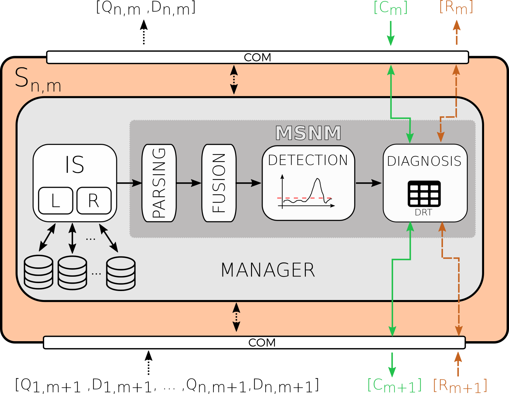
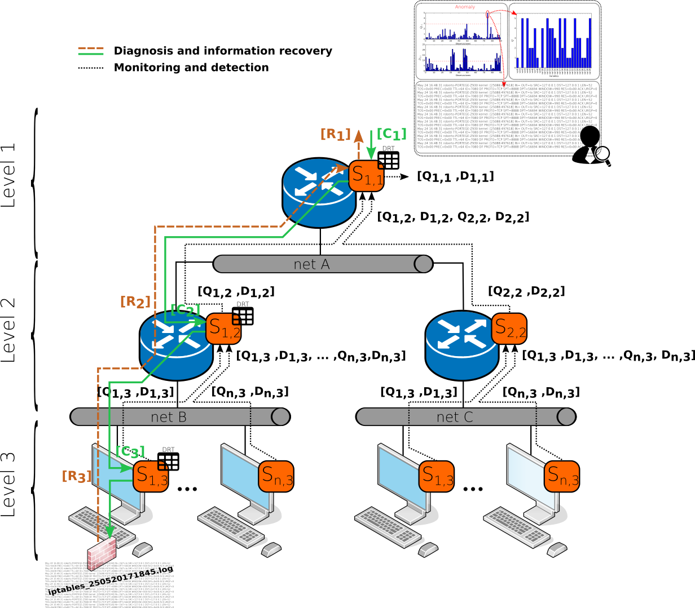

Description
------------

**MSNMSensor** (Multivariate Statistical Network Monitoring Sensor) shows the practical suitability of the approaches found in [PCA-MSNM](https://www.sciencedirect.com/science/article/pii/S0167404816300116) and in [Hierarchical PCA-MSNM](http://ieeexplore.ieee.org/document/7823895/) works. The first one present the MSNM approach and new multivariate statistical methodology for network anomaly detection while the second one proposes uses the previous one in a hierarchical and structured network systems. The main idea behind these works, is the use of multivariate statistical techniques to generate useful information in the form of two statistics. Such a light information comes from lower to higher levels in a network hierarchy. This way, the root sensor (for example, a border router) received all the statistical information being able to compute its own statistics (Q,D). By inspecting this statistics, a security analyst can determine if anomalous event are happening when some of the statistic values are above certain control limits.

**MSNMSensor** is conceived to be extremely scalable and aseptic because just two parameters are sent among levels or devices in the monitored network or system. Additionally, the MSNMSensor is able to manage multiple and heterogeneous type data sources at each monitored devices thanks to the [FCParser (Feature as a Counter Parser)](https://github.com/josecamachop/FCParser) feature engineering approach.

## Installation

#### Requirements

MSNSensor runs with python 2.7 and has been successfully tested on Ubuntu from 16.04 version and above. Also, the following dependencies has to be installed.

  * numpy >= 1.14
  * scipy >=1.0
  * pyyaml >= 3.12
  * IPy >= 0.83
  * pandas >= 0.22
  * watchdog >= 0.8.3
  * [FCParser (Feature as a Counter Parser) == 1.0.0](https://github.com/josecamachop/FCParser/releases/tag/v1.0.0)

#### How to install

Creating a python execution environment is, probably the better way to run the application. So I recommend you to create one
before doing the requeriments installation. Anaconda environment can help you and, if you decide to use it, run the following
commands:

    $ conda create -n py27 python=2.7
    $ conda activate py27

Running the previous command will install everything needed.

	(py27) $ pip install -r requirements.txt
	
#### How to run an example

Please see instructions at [examples](examples/README.md) or download the pre-configured
VM at [MSNM-S-UBUNTU](https://drive.google.com/file/d/1zNf4mIuKEfEwQIDwPUbkM9oGiOVcCa22/view?usp=sharing). We recommend you to use the VM. Remember to pull the repository to get the MSNM-S project updated. In the following, you can see the necessary steps to run the pre-configure experiment in the VM:

*Running the MSNM-Ss (backend)*

Open a terminal window and activate netflow daemon and collector.

	$ cd ~/msnm-sensor/scripts/netflow/
	$ sudo ./activateNetflow.sh (pass: msnm1234)
 
Wait for 5 minutes to get netflow records.
Run and deploy the MSNM-Ss in example/scenario_4 example:

	$ cd ~/msnm-sensor/scripts/
	$ conda activate py27
	$ ./start_experiment.sh ../examples/scenario_4/
	$ ps -ef | grep msnmsensor (just to check if all the four MSNM-Ss are running)
	$ tail -500f ~/msnm-sensor/examples/scenario_4/borderRouter/logs/msnm.log (another way to see how the MSNM-S is working. Replace the name of the MSNM-S if you want to see the others.)

*Running the dashboard (frontend):*

Open a new terminal window.

	$ cd ~/msnm-sensor/dashboard/
	$ conda activate msnm-dashboard
	$ ln -s ../examples examples
	$ python manage.py runserver

Browse to http://localhost:8000

## Authors and license
<a href="https://www.safecreative.org/work/1902149945824-msnm-sensor" target="_blank"> 
MSNM Sensor - 
GNU GPL - 
Roberto Magán-Carrión, José Camacho and Gabriel Maciá-Fernández 
</a> 
