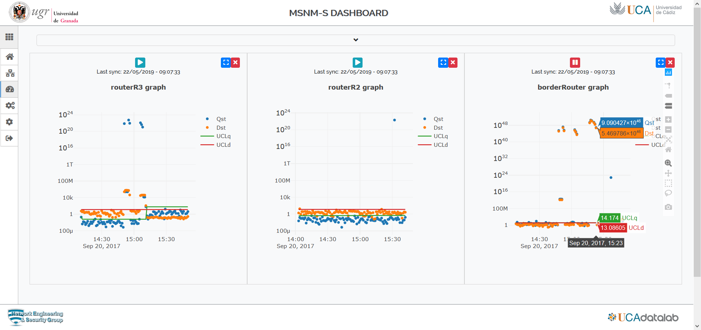

MSNM-S Dashboard
----------------

Visualization interface to interact with the deployed MSNM-S.

----------------

## Installation

#### Requirements

Despite of MSNM-S runs with python 2.7, the dashboard runs with python 3.5 instead and uses 
Django engine.

#### How to install

Creating a python execution environment is, probably the better way to run the application. So we recommend you to create one
before doing the requirements installation. Anaconda environment can help you and, if you decide to use it, run the following
commands:

    $ cd dashboard/
    $ conda create -n py35 python=3.5
    $ conda activate py35

Running the previous command will install everything needed.

	(py35) $ pip install -r requirements.txt
	
#### Configuration

By default the dashboard links to the obtained output files 
by running the experiment in *examples/scenario_4/* We recommend 
you to link output data folders by running this command:

    $ (py35) ln -s ../examples examples

However the output folder can be configured accordingly by modifying *dashboard/mainboard/config.py* file.
In this case move the file *examples/scenario_4/global.yaml* to the new
folder.
	
#### How to run the dashboard application

Dashboard application relies on the use of Django engine, so we have to start the engine and after that open a browser
and type http://localhost:8000 (default configuration).

    (py35) $ python manage.py runserver

Currently, the application gets the monitoring output values of the scenario created in ``examples/scenario_4/`` However, you can
modify the path of files to be monitored and depicted by modifying the ``dashboard/mainboard/config.py``
